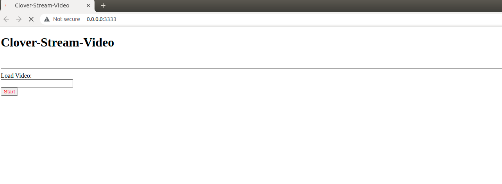

Motion detection with opencv 
# Install 
```commandline
imutils
cv2
numpy
Flask
```

# Run: 
+ `python app_motion_detection.py`
+ Go to app: http://0.0.0.0:3333/
+ 
+ Add link video and test result.

# Motion detector using background subtraction algorithm.
+ Tích lũy giá trị trung bình các trọng số của N frame trước.
+ Lấy frame hiện tại và trừ nó cho trung bình các trọng số.
+ Định ngưỡng đầu ra của phép trừ để làm nổi bật các vùng có sự khác biệt đáng kể về giá trị pixel.
  (white cho nền khác biệt, black cho background)
+ Áp dụng những kí thuật xử lí ảnh đơn giản như là `erosions`(xói mòn), `dilations`(giãn nở), để giảm nhiễu.
+ Sử dụng chức năng phát hiện đường viền(`contour detection`) để trích xuất các vùng chứa chuyển động.


# Reference
1. [opencv-stream-video-to-web-browser-html-page](https://www.pyimagesearch.com/2019/09/02/opencv-stream-video-to-web-browser-html-page/)
2. [basic-motion-detection](https://www.pyimagesearch.com/2015/05/25/basic-motion-detection-and-tracking-with-python-and-opencv/)